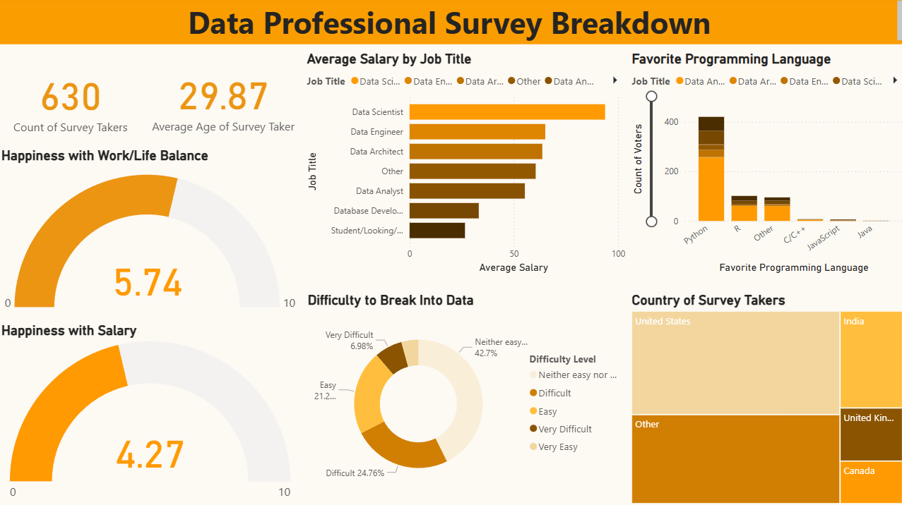

# 📊 Data Professionals Survey — Market Research Dashboard (Power BI)


> Survey analysis of 630 data professionals worldwide—salary trends, job satisfaction, programming preferences, and career entry barriers—visualized in Power BI.

[Overview](#-overview) · [Dashboards](#-dashboards) · [Project Structure](#-project-structure) · [Getting Started](#-getting-started) · [Documentation](#-documentation)

---

## 📋 Overview

### 🎯 Problem Statement

> HR and talent teams need data-driven insights into the data professional market—compensation, satisfaction, skills, and perceived career barriers. Survey data is often trapped in spreadsheets, hard to explore.

### 💡 Solution

A **Power BI dashboard** that:

- Analyzes survey responses from 630 data professionals worldwide
- Visualizes salary, job satisfaction, programming language preferences, and career entry perceptions
- Uses **Power Query** (M), **DAX**, and **data modeling** for transformation and analytics
- Provides interactive filters and drill-down for stakeholders

### ✨ Key Features

| Feature | Description |
|---------|-------------|
| 💰 **Compensation analysis** | Salary by job title; Data Scientists $95K+, Engineers $65–70K, Analysts $55–60K |
| 😊 **Job satisfaction** | Work/life balance (5.74/10), salary happiness (4.27/10) gauges |
| 🐍 **Programming preferences** | Python dominant (400+ votes); R, C/C++, JS, Java breakdown |
| 🚧 **Career barriers** | "Easy" vs "Difficult" to break in; distribution by perception |
| 🌍 **Demographics** | 630 respondents, avg age 29.87; geographic distribution (US, India, UK, Canada) |
| 📊 **Interactive visuals** | Cards, gauges, bar charts, donut chart, treemap |

### 👥 Target Audience

- **Recruiters** — Evidence of Power BI, DAX, survey analytics
- **HR / talent** — Compensation and satisfaction benchmarks
- **Data professionals** — Industry insights and career context

---

## 📊 Dashboards

### 🖼️ Dashboard Preview



### 📈 Key Visualizations

| Visual | Purpose |
|--------|---------|
| **KPI cards** | Total participants, average age |
| **Happiness gauges** | Work/life balance, salary satisfaction (0–10) |
| **Salary by job title** | Horizontal bar chart; compensation across roles |
| **Favorite programming language** | Stacked bar; Python, R, C/C++, JS, Java |
| **Difficulty to break into data** | Donut chart; Easy / Difficult / Neutral |
| **Country distribution** | Treemap; geographic spread of respondents |

---

## 🛠️ Tech Stack

| Component | Technology |
|-----------|------------|
| **Visualization** | Microsoft Power BI Desktop |
| **ETL / Transform** | Power Query (M Language) |
| **Calculations** | DAX (Data Analysis Expressions) |
| **Data modeling** | Relationships, star schema principles |
| **Data format** | CSV |

### 🔧 Tools & Techniques

- **Power Query** — Data cleaning, reshaping, preparation
- **DAX** — Calculated measures, aggregations
- **Data modeling** — Table relationships, optimized model

---

## 📁 Project Structure

```
market-research-analytics-visualization-powerbi/
├── data/
│   └── raw/
│       └── data_professionals_survey.csv
├── assets/
│   ├── powerbi/
│   │   └── data_professional_survey_dashboard.pbix
│   └── images/
│       └── data_professionals_survey_dashboard.png
├── README.md
└── .gitignore
```

### 📂 Folder Descriptions

| Folder | Purpose |
|--------|---------|
| `data/raw/` | Survey dataset (630 data professionals) |
| `assets/powerbi/` | Power BI report (.pbix) |
| `assets/images/` | Dashboard preview image |

---

## 🚀 Getting Started

### Prerequisites

- **Power BI Desktop** (free)
- Data file: `data/raw/data_professionals_survey.csv`

### Quick Start

1. **Clone the repo**
   ```bash
   git clone https://github.com/Konstant-gk/market-research-analytics-visualization-powerbi.git
   cd market-research-analytics-visualization-powerbi
   ```

2. **Open the report**
   - Open `assets/powerbi/data_professional_survey_dashboard.pbix` in Power BI Desktop
   - If prompted, point the data source to `data/raw/data_professionals_survey.csv`

3. **Refresh data** (optional)
   - Home → Transform data → Close & Apply, or refresh from report view

---

## 📈 Key Insights

| Insight | Value |
|---------|-------|
| **Total respondents** | 630 data professionals |
| **Average age** | 29.87 years |
| **Top countries** | US, India, UK, Canada |
| **Highest salary** | Data Scientists ($95K+) |
| **Work/life happiness** | 5.74/10 |
| **Salary happiness** | 4.27/10 |
| **Most popular language** | Python (400+ votes) |
| **Career entry** | 42.7% "Neither easy nor difficult"; 24.76% "Difficult"; 21.2% "Easy" |

---

## 📚 Documentation

| Resource | Description |
|----------|-------------|
| [assets/images/](assets/images/) | Dashboard preview |
| [assets/powerbi/](assets/powerbi/) | Power BI report |

---

## ✅ What This Project Demonstrates

| Competency | How It's Shown |
|------------|----------------|
| **Power BI** | Reports, visuals, DAX, Power Query |
| **Survey analytics** | Demographics, compensation, satisfaction, skills |
| **Data modeling** | Relationships, measures |
| **Professional structure** | `data/`, `assets/` layout; clear README |
| **Portfolio readiness** | Scannable, recruiter-friendly docs |

---

## 🤝 Contributing

1. Fork the repository
2. Create a branch (`feat/`, `fix/`, `docs/`)
3. Open a Pull Request

---

## 📄 License

MIT — see [LICENSE](LICENSE) if present.

---

## 📬 Contact

- **Repository:** [Konstant-gk/market-research-analytics-visualization-powerbi](https://github.com/Konstant-gk/market-research-analytics-visualization-powerbi)
- **Issues:** [GitHub Issues](https://github.com/Konstant-gk/market-research-analytics-visualization-powerbi/issues)
